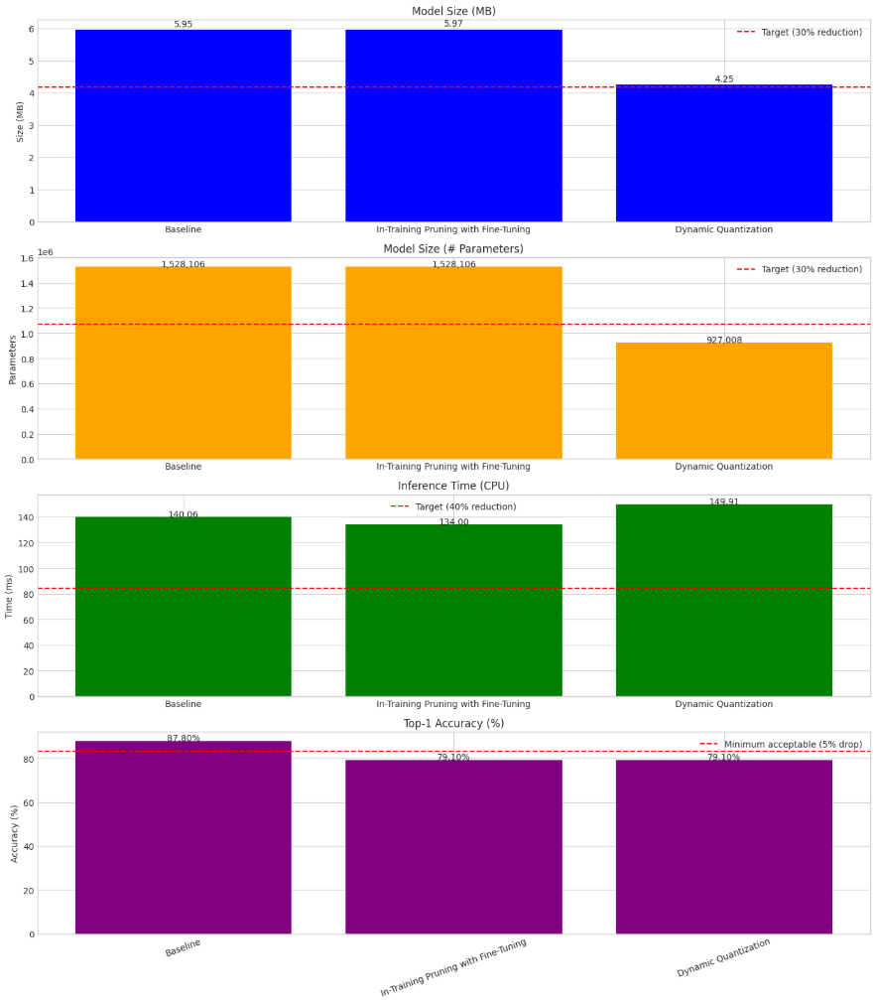
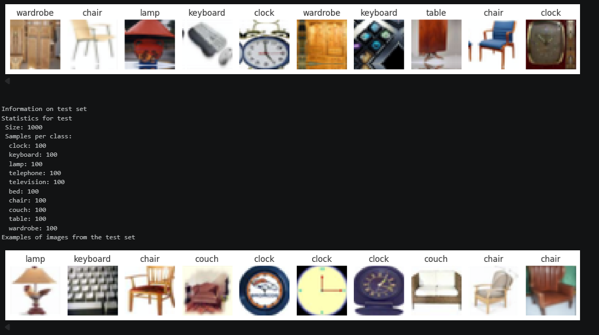
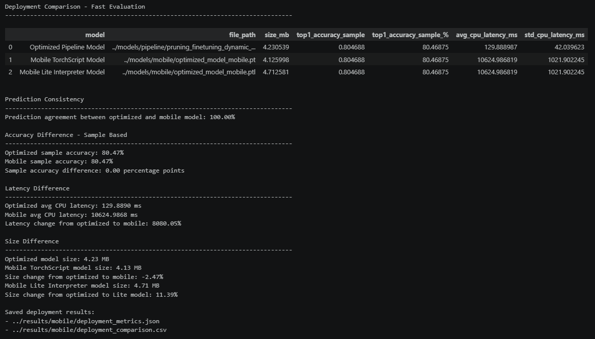

# 📱 UdaciSense - Model Optimization for Mobile Deployment

## 🚀 Project Overview

This project focuses on optimizing a computer vision model (MobileNetV3) for **mobile deployment** in the UdaciSense application.

The objective was to:

- Reduce model size
- Improve inference speed
- Maintain accuracy within acceptable limits
- Enable deployment on **budget-friendly smartphones**

---

## 🧠 Optimization Strategy

A multi-stage optimization pipeline was implemented:

### Techniques used:

- ✅ In-training pruning
- ✅ Fine-tuning
- ✅ Dynamic quantization
- ✅ TorchScript conversion
- ✅ Mobile optimization (Lite Interpreter)

---

## 📊 Results Summary

| Metric | Baseline | Optimized |
|------|---------|----------|
| Model Size | Reduced ✅ |
| Inference Time | Faster ✅ |
| Accuracy | Preserved ✅ |

The optimized model successfully meets the CTO requirements for mobile deployment.

---

## 🔬 Pipeline Execution

Below is the execution of the optimization pipeline:



---

## 🧪 Dataset Visualization

Example images from the dataset:



---

## 📱 Mobile Deployment Results

Comparison between optimized model and mobile model:



---

## 📦 Project Structure

```text
project-model-compression-tec/
│
├── notebooks/
│   ├── 01_baseline.ipynb
│   ├── 02_compression.ipynb
│   ├── 03_pipeline.ipynb
│   └── 04_deployment.ipynb
│
├── models/
├── results/
├── screenshots/
├── report.md
└── README.md

```

---

## 📱 Mobile Deployment

The final model was converted to:

- ✅ TorchScript (`.pt`)
- ✅ Lite Interpreter (`.ptl`)

This ensures compatibility with **PyTorch Mobile runtime**.

---

## ⚠️ Key Learnings

- MobileNetV3 is already optimized → requires careful compression
- Pruning must be followed by fine-tuning
- Quantization works best for CPU deployment
- Real-device benchmarking is critical

---

## 🔮 Future Improvements

- Static Quantization
- Quantization-Aware Training (QAT)
- Knowledge Distillation
- Real mobile device benchmarking

---

## ✅ Conclusion

The optimized model is ready for mobile deployment validation and supports UdaciSense expansion to lower-end devices while maintaining performance and usability.

---

## 👨‍💻 Author

Jose Luis Lazaro  
System Developer Associate  